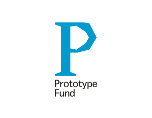
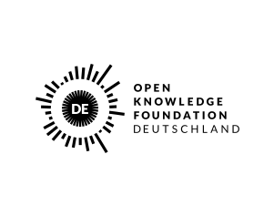

<h1 style="border-bottom:none; margin-bottom:0;">😽 Chatmosphere</h1>
<b>The Open Source Videochat for Cozy Talks</b>

**Chatmosphere is an open source project that aims to make video calls informal and natural**. We missed the dynamics of a self-organizing crowd hanging out at one big table together. The big table in a bar, where so many discussions, jokes, comforting talks, utopias and ideas happen. With chatmosphere you can move and zoom in the area and hear people that are located near by louder and have dynamic talks. To learn more about the Chatmosphere project and ideas have a look in our [ABOUT.md](docs/ABOUT.md)

### Helpful Links
* [How to run Chatmosphere](docs/INSTALL.md)
* [Contribution Guideline](docs/CONTRIBUTION.md)
* [Find Support here](https://github.com/Chatmosphere/chatmosphere-app/discussions)
* [Code of Conduct for Excellent Humans](docs/CODE_OF_CONDUCT.md)
* [Roadmap](https://github.com/orgs/Chatmosphere/projects/4)
* [Code License](LICENSE.md)
* [Donations to help us maintaining Chatmospere and run our demo server](https://opencollective.com/chatmosphere)

<!-- 
You can learn more about the awesome Create React App Starter Kit in the [Create React App documentation](https://facebook.github.io/create-react-app/docs/getting-started).  
To learn more about React, check out the [React documentation](https://reactjs.org/).  
-->
<!-- TODO: write [Shoutout and Fame] -->

### Funded from September 2020 until February 2021 and September 2021 until February 2022 by

&nbsp; &nbsp; &nbsp; &nbsp; &nbsp; &nbsp; &nbsp; &nbsp; &nbsp; &nbsp; &nbsp; &nbsp; 

