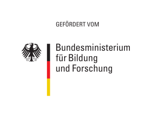

# Chatmosphere

We enable informal conversation dynamics in the digital space.

## What it is?

Chatmosphere is an open source project that aims to improve video call experiences. 

## Why is it useful?

Haven't you had this problem, when you and your friends met in a video call and just couldn't figure out who would talk next? Haven't you been bothered when everybody talks at once and you couldn't understand a thing? Or when you wanted to tell your best buddy something and had to wait for the conversation to end  or use whatsapp in order to tell her?! We're trying to help you with a focus not just on functionality (code), but also on a pleasing user experience. And hey, it's open source…

## Why are we doing this?

The idea came up during the first SARS-CoV-2 shutdown, when some of us started a [virtual bar](https://www.notion.so/How-it-started-e201ac34fbec4429b5dabe7de9699d1e). We found informal group conversations restricting and hierarchical, as the majority of tools is created to enable (corporate) meeting culture. We missed the dynamics of a self-organizing crowd hanging out at one big table together. The big table in a bar, on which so many discussions, jokes, comforting talks, utopias and ideas happened.

It's our goal to find interaction patterns that enable informal, unmoderated video calls. It's our hypothesis, that we can prototype these interactions based on spatialized sound.

## Code of Conduct 

We're working with the [Citizen Code of Conduct](CODE_OF_CONDUCT.md) in order to make this project a respectful and happy space.

## Technologies

We're using the [jitsi API](https://github.com/jitsi/lib-jitsi-meet/blob/master/doc/API.md), [react](https://reactjs.org/) and [type-script](https://www.typescriptlang.org/).

## How you can get started with the project?

Check out our [README](README.md).

## Extended documantation

For our research and other notes, check out our website: [https://chatmosphere.github.io/](https://chatmosphere.github.io/)

## Licensing

We want everybody to be able to participate in this project. Since jitsi is using Apache 2.0, we're also using this for our code. Until we have a better idea, we use the Beer Ware License for all designs. We know that it would be nice if design-files itself were open-source files – thats an issue still to be tackled since most design software is not open source. Still you're welcome to use the assets and adjust to your likings. 

SPDX-License-Identifier: [Apache-2.0 OR GPL-2.0-or-later](LICENSE.md)
 
SPDX-License-Identifier: Beer Ware License for Design Files

<blockquote> 
 ---------------------------------------------------------------------------- 
 "THE BEER-WARE LICENSE" (Revision 42): 
 info@chatmosphere.cc wrote this file. As long as you retain this notice you 
 can do whatever you want with this stuff. If we meet some day, and you think 
 this stuff is worth it, you can buy us a beer in return. 
 ----------------------------------------------------------------------------
</blockquote>

## Project status & where do we want to go with this?

We're currently funded by the [Prototype Fund](https://prototypefund.de/) in order to develop a first prototype of our idea and we'd love to carry on working on this. We hope to find additional funding. So if you know something or someone or have any idea, drop us a line. We'd highly appreciate it. 

## How can i get in touch?

If you have any questions or issues regarding this project, feel free to contact us anytime and we'll try to answer as quick as life allows us to. [info@chatmosphere.cc](mailto:info@chatmosphere.cc)

## Funded from September 2020 until February 2021 and from September 2021 until February 2022 by

&nbsp; &nbsp; &nbsp; &nbsp; &nbsp; &nbsp; &nbsp; &nbsp; &nbsp; &nbsp; &nbsp; &nbsp; 

