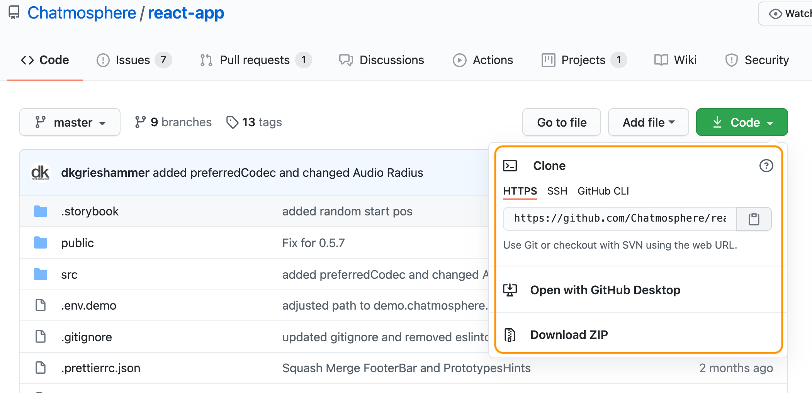

# 😽 Install Chatmosphere


-> If you want to run **your own Jitsi Server** checkout [these instructions]() 

## ☝️ Download Files
* go to our github repository: [Chatmosphere/chatmosphere-app](https://github.com/Chatmosphere/chatmosphere-app)
* Download Zip or clone repo



* Either download the ZIP file and unpack it or clone with git
* Then open the folder in your favourite IDE 

## ✌️ Install the App

```shell
# run yarn install or npm install
npm install
```

#### Certificates

WebRTC - the basic technology Jitsi and Chatmosphere are running on, needs HTTPS to run. So we need a local certificate to start the app.;
a nice description to add one can be found here
[https://www.freecodecamp.org/news/how-to-set-up-https-locally-with-create-react-app/](https://www.freecodecamp.org/news/how-to-set-up-https-locally-with-create-react-app/)

So if you have not done so already for some other project, make your local machine a certification authority to create valid certificates. We're using 🍺 [homebrew](https://brew.sh/) for that.

```bash
# Install mkcert tool with homebrew
brew install mkcert

# Install nss (only needed if you use Firefox)
brew install nss

# Setup mkcert on your machine (creates a CA)
mkcert -install
```

#### Create a Certificate
Then, from the root folder of your downloaded chatmosphere directory that you just downloaded, run:

```bash
# Create .cert directory if it doesn't exist
mkdir -p .cert

# Generate the certificate (ran from the root of this project)
mkcert -key-file ./.cert/key.pem -cert-file ./.cert/cert.pem "localhost"
```

## 😻 Run Chatmosphere

```bash
# to start chatmosphere, type
npm start
# or if you prefer yarn
yarn start
```
Runs the app in the development mode.\
Open [http://localhost:3000](http://localhost:3000) to view it in the browser.

The page will reload if you make edits.\
You will also see any lint errors in the console.

The default setup uses a test session on [https://meet.jit.si/](https://meet.jit.si/) by default; the public jitsi-meet should only be used for testing, not for production. They now offer [hosted services](https://jaas.8x8.vc/) and since they're awesome we hope to make chatmosphere compatible soon. 

To use your very own Jitsi Server, copy `serverConfig-example.ts` and rename it to `serverConfig.ts`
Replace the configuration in the file with your very own Jitsi Server paths:

```bash
export const connectionOptions = {
	serviceUrl: '//your.domain.com/http-bind',
	hosts: {
		domain: "your.domain.com",
		muc: 'conference.your.domain.com',
		// anonymousdomain: ''
	},
	bosh: '//your.domain.com/http-bind',

	clientNode: 'http://jitsi.org/jitsimeet'
}
```

Restart your app *(ctrl+c),* then `npm start` aaaaaand you're done - test it and please tell us how it worked 🖖 😽 🎉

---

## Other Available Scripts

### `npm test` `yarn test`

Launches the test runner in the interactive watch mode.\
See the section about [running tests](https://facebook.github.io/create-react-app/docs/running-tests) for more information.